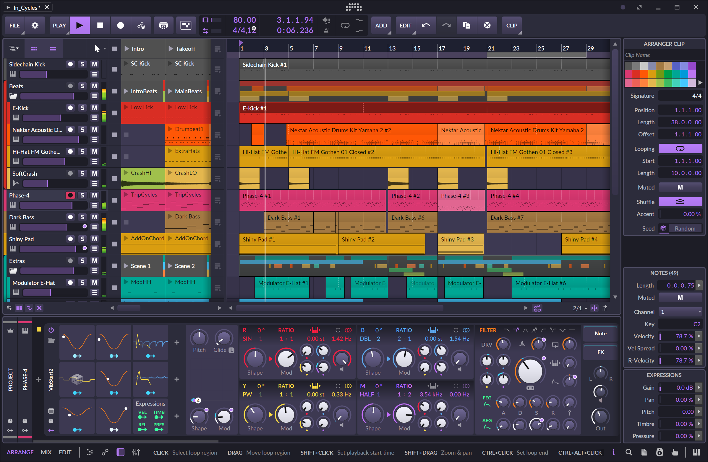
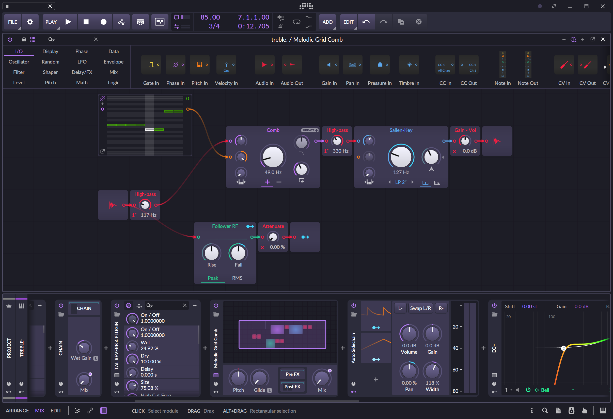

# bitwig-theme-dark-purple

Dark Purple theme for Bitwig Studio, inspired by the [JetBrains Dark Purple theme](https://github.com/OlyaB/DarkPurpleTheme)!

*"In Cycles" demo project open in Bitwig Studio 5.2 with Dark Purple theme applied*

*Example of FX grid with theme applied*

## Usage

Install using [bitwig-theme-editor](https://github.com/Berikai/bitwig-theme-editor). I've tested this theme on Bitwig 5.2.
